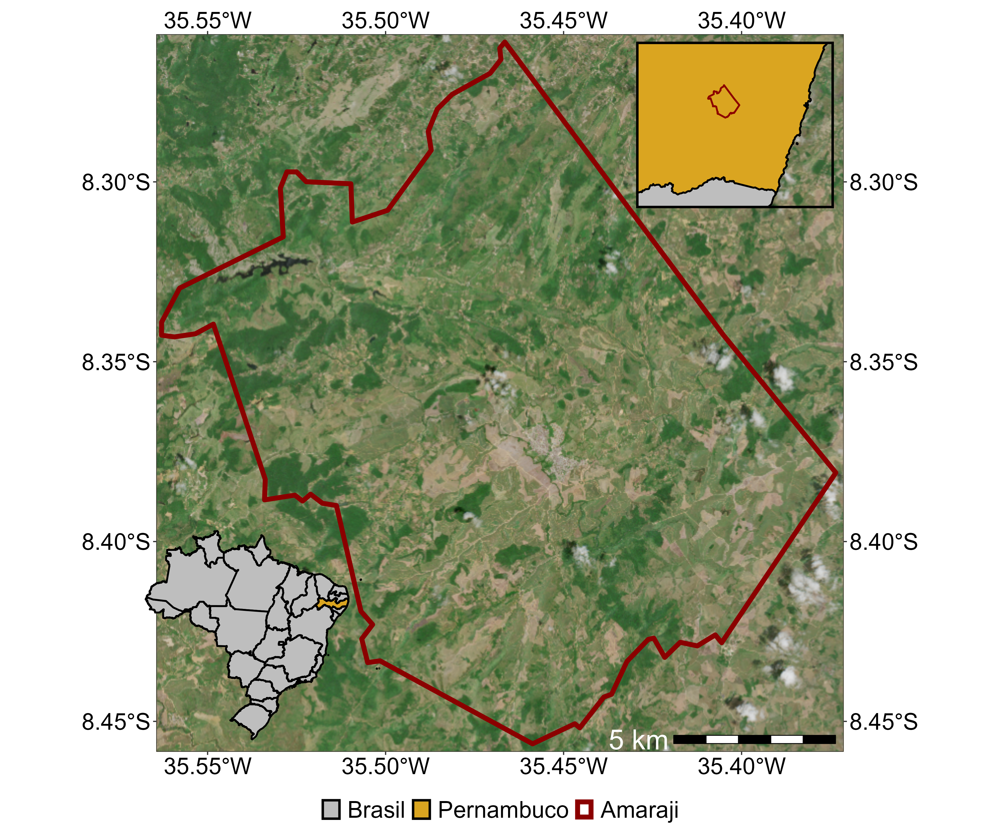
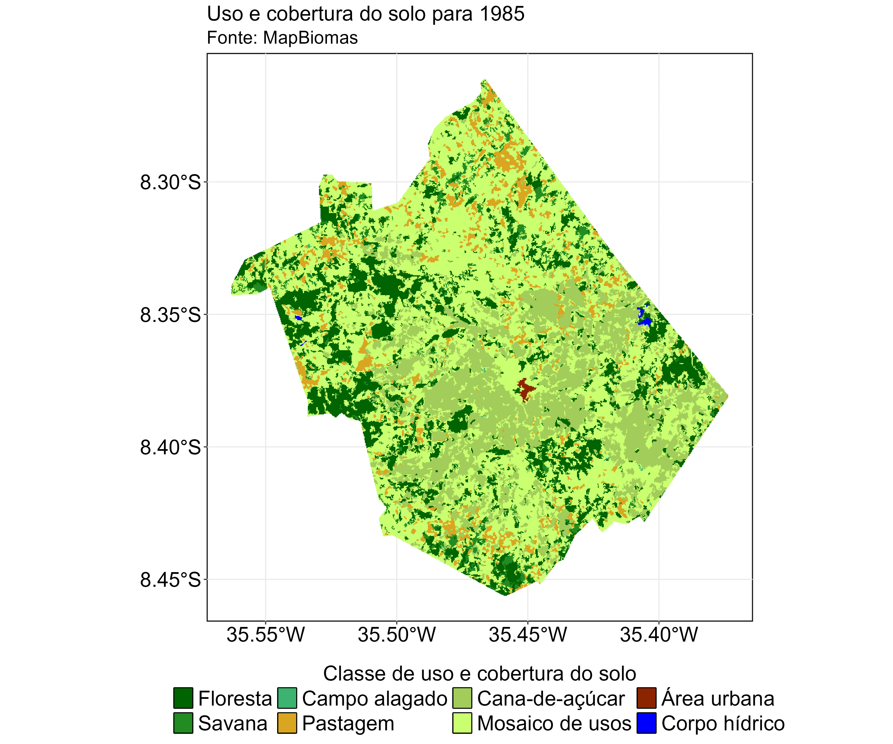
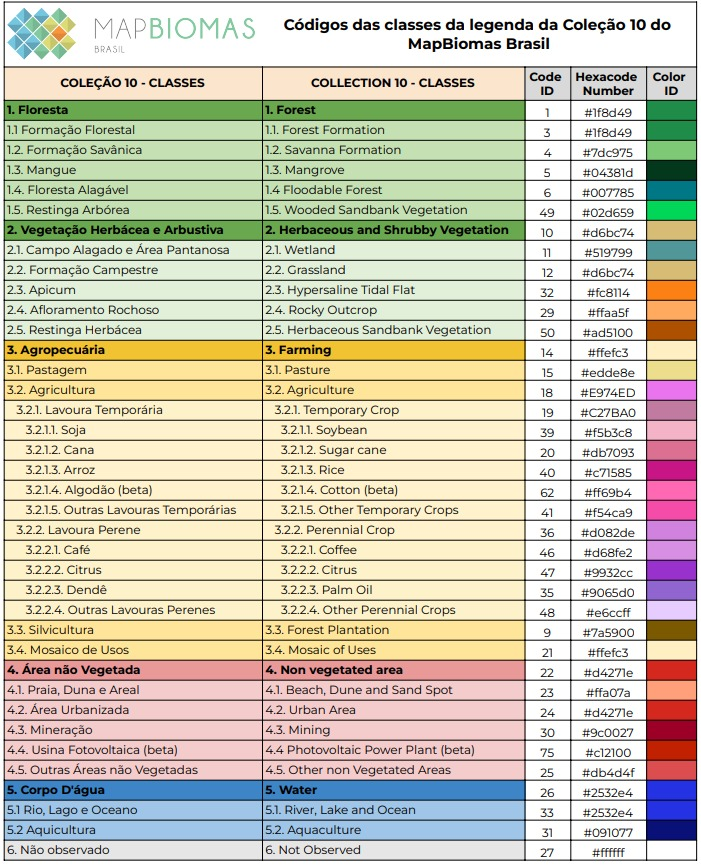

# Ecologia da paisagem de Amaraji

> Repositório para scripts usados para analisar a ecologia da paisagem do município de Amaraji, Pernambuco, Brasil, usando dados do [MapBiomas](https://brasil.mapbiomas.org/).

# Mapa de Amaraji

# Evolução da paisagem

# Legenda das classes de uso e cobertura do solo

# Altitude

